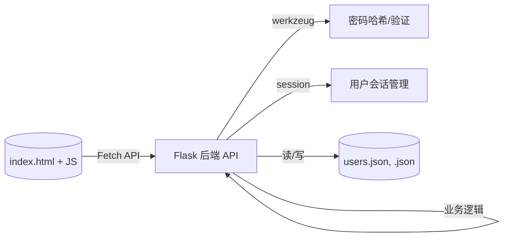

## AI辅助开发智能课程表实验报告


## 一、问题背景

学生群体的课程管理需求日益增长，传统方式效率低下且缺乏智能化。开发一款集课程管理、智能提醒、专注力辅助及人文关怀于一体的应用，能有效提升学习效率和体验，满足学生对个性化、智能化工具的需求。


## 二、实验目的

*   基于 AI 编程助手的协作，独立设计并实现一款功能完整的 Web 应用。
*   实现图形化界面及至少四项核心功能（课程 CRUD）。
*   深入探究和记录在软件生命周期的不同阶段（设计、编码、调试、学习），AI 编程助手的具体应用方式、优势与局限性。
*   详细分析关键功能模块（用户认证、CRUD、诗词推荐）的核心代码实现逻辑。
*   记录并分析开发过程中遇到的具体技术挑战和逻辑问题，以及借助 AI 和个人思考解决问题的过程。
*   最终产出可运行的应用原型及包含完整代码、文档的成果。


## 三、 技术栈与工具

*   **后端语言/框架:** Python 3 / Flask
*   **密码处理:** Werkzeug.security
*   **前端技术:** HTML5, CSS3 (Tailwind CSS via CDN), JavaScript (ES6+, Fetch API)
*   **数据存储:** JSON 文件
*   **版本控制:** Git, GitHub 
*   **AI 编程助手:** 前端使用deepsite，后端主要基于gemini 2.5pro
*   **开发/调试工具:** VS Code, 浏览器开发者工具, Postman 
*   **部署相关 :** 阿里云 ECS (Ubuntu), Nginx, Gunicorn, Systemd


## 四、系统架构

采用前后端分离架构。前端负责界面展示和用户交互，通过 Fetch API 调用后端 RESTful 接口。后端 Flask 应用处理业务逻辑和数据持久化。



在规划初期，我就拟定了项目架构：

```
intelligent-schedule/
├── app.py             # Flask 后端主程序
├── requirements.txt   # Python 依赖
├── data/                # 存储用户课程数据的目录 (自动创建)
│   └── user1.json     # 示例用户数据文件 (自动创建)
│   └── guest.json     # 示例访客数据文件 (自动创建)
└── templates/           # Flask 模板目录
    └── index.html     # 前端文件 
```


## 五、AI 编程助手集成在开发中的应用

由于本次实验要求我们借助AI编程助手，实现一款完整软件的开发。故我选择了利用deepsite制作前端，思维能力强大的gemini 2.5pro开发后端。

首先我利用deepsite提问，希望制作美观的课程表，让它帮我生成index.html，让它具有增删改查功能，并在此基础上增加其他功能：

好的，这里是根据“实验报告行文风格”的要求，对“韶华课笺”智能课程表各项功能的简洁介绍：

1.  **课程添加 (Course Addition):** 本功能允许用户通过模态表单输入新课程的详细信息，包括名称、教师、地点、星期、时间段及自定义颜色。系统在保存数据时，会自动对具有相同名称的课程应用统一的颜色标识，以增强视觉关联性。

2.  **课程查询与浏览 (Course Query and Browsing):** 系统提供两种课程信息展示方式：主界面的网格视图按时间与星期直观布局课程；侧边栏的列表视图则按课程名称分组，并支持折叠/展开。此外，提供搜索框，支持根据课程名或教师名对列表视图进行实时过滤。

3.  **课程修改 (Course Modification):** 用户可通过点击课程条目进入详情，进而触发编辑模式。系统在编辑模态框中预填充现有数据，用户修改并保存后，后端将更新对应记录。颜色同步机制确保所有同名课程的颜色标识在修改后保持一致。

4.  **课程删除 (Course Deletion):** 在课程编辑模式下，提供“删除”操作入口。经用户二次确认后，系统将从该用户的数据集中移除指定的课程记录。

5.  **用户认证 (User Authentication):** 实现基于 Flask Session 的用户注册、登录及登出机制。通过会话管理，确保不同登录用户的课程数据相互隔离，为用户提供个性化的数据存储空间。未登录用户则操作独立的访客数据。

6.  **数据导入/导出 (Data Import/Export):** 为方便数据迁移和备份，提供将当前用户课程表导出为 JSON 或 Excel 文件的功能。同时，支持从这两种格式的文件导入课程数据，导入操作经确认后会覆盖用户现有的全部课程。

7.  **下一节课提醒 (Next Course Reminder):** 在界面侧边栏动态展示距离当前时间最近的下一节预定课程的关键信息（名称、地点、时间等）。包含一个实时更新的倒计时器，显示距离上课的剩余时间或课程当前状态（如进行中、已结束）。

8.  **每日诗词 (Daily Poetry):** 为提升应用的人文体验，集成每日诗词推荐功能。利用服务器端 Session 跟踪用户已浏览诗词，确保在会话周期内或遍历完诗词库前，向用户推送不同的、不重复的精选古典诗词。

9.  **番茄钟 (Pomodoro Timer):** 集成一个基于番茄工作法的前端时间管理工具。用户可自定义工作和休息时长，启动计时器进行专注时段管理，辅以视觉进度反馈，旨在帮助用户提高学习效率。

经过反复提问deepsite并debug，前端初步效果如图：


随后，我将生成的index.html喂给gemini 2.5pro，要求其用python帮我写后端


具体的问答情况见链接：https://aistudio.google.com/app/prompts?state=%7B%22ids%22:%5B%221Uje6wVssL02_5_5C5iUa1tF5ZepwYt20%22%5D,%22action%22:%22open%22,%22userId%22:%22115243048093613687476%22,%22resourceKeys%22:%7B%7D%7D&usp=sharing

当然，这个时候的程序还存在一些小bug，我自己修改了一些地方，最终成功制作出一款美观的课程表/番茄钟系统。


## 六、代码分析 

### 核心增删改查功能

在开发核心增删改查功能时，AI 助手在生成基础路由结构、提供数据库/文件操作模板、以及前端 Fetch 调用示例方面提供了很大帮助。但具体的业务逻辑、数据校验、错误处理和前后端接口契合仍需开发者仔细设计和编码。

*   **查询 (Read - R): 获取用户课程**
    *   **前端交互:** 页面加载或用户登录后，`loadCourses()` 函数触发。
    *   **API 端点:** `GET /api/courses`
    *   **后端核心代码 (`app.py` - `get_courses` 函数):**
        ```python
        @app.route('/api/courses', methods=['GET'])
        def get_courses():
            """获取当前用户的所有课程"""
            # 1. load_data() 根据 session 获取用户 ID 并读取对应 JSON 文件
            user_data = load_data()
            # 2. 从读取的数据中安全地获取 'courses' 列表，若不存在或格式错误则返回空列表
            courses = user_data.get('courses', [])
            # 3. 将课程列表 JSON 化并返回给前端
            return jsonify(courses)
        ```
        *   **代码分析:** 该函数逻辑清晰，核心在于 `load_data()`（内部处理用户识别和文件读取）和 `jsonify()`。AI 可辅助生成此 Flask 路由的基本结构。个人需实现 `load_data()` 的具体逻辑，确保能根据 session 正确找到并安全解析文件。
    *   **AI 辅助点:** 请求 Flask GET 路由模板；JSON 响应处理示例。

*   **添加 (Create - C): 新增课程**
    *   **前端交互:** 用户在模态框填写信息，点击保存，触发 `saveCourse()` 函数（内部判断是新增模式）。
    *   **API 端点:** `POST /api/courses`
    *   **后端核心代码 (`app.py` - `add_course` 函数):**
        ```python
        @app.route('/api/courses', methods=['POST'])
        def add_course():
            # 1. 获取前端发送的 JSON 数据
            new_course_data = request.json
            # 2. 基本验证：检查必要字段是否存在
            if not new_course_data or not all(k in new_course_data for k in ('name', 'day', 'time', 'color')):
                return jsonify({'error': '缺少必要的课程信息...'}), 400
            new_course_data.setdefault('teacher', 'N/A') # 处理可选字段
            new_course_data.setdefault('location', 'N/A')
        
            # 3. 加载当前用户现有课程
            user_data = load_data()
            courses = user_data.get('courses', [])
            # 4. 生成唯一 ID
            new_course_data['id'] = int(time.time() * 1000) + random.randint(0, 999)
        
            # 5. 颜色同步逻辑 (核心业务逻辑)
            existing_color = None
            for course in courses:
                if course.get('name') == new_course_data['name'] and course.get('color'):
                    existing_color = course.get('color')
                    break
            if existing_color:
                new_course_data['color'] = existing_color
            # (省略了新名称同步其他课程颜色的逻辑，因为此时同名课程应只有自己)
        
            # 6. 追加新课程并保存
            courses.append(new_course_data)
            user_data['courses'] = courses
            if save_data(user_data):
                # 7. 返回成功创建的课程数据和 201 状态码
                return jsonify(new_course_data), 201
            else:
                return jsonify({'error': '保存课程失败'}), 500
        ```
        *   **代码分析:** 实现了数据接收、验证、ID 生成、颜色同步（核心业务点）、数据追加和保存。其中 ID 生成策略、颜色同步的具体逻辑是开发者根据需求设计的。错误处理返回了相应的状态码。
    *   **AI 辅助点:** 请求 Flask POST 路由模板；`request.json` 用法；Python 字典操作示例；文件保存错误处理模式。

*   **修改 (Update - U): 更新课程**
    
    *   **前端交互:** 用户编辑课程，点击保存，触发 `saveCourse()` 函数（内部判断是编辑模式，包含 `editingCourseId`）。
    *   **API 端点:** `PUT /api/courses/<int:course_id>`
    *   **后端核心代码 (`app.py` - `update_course` 函数):**
        ```python
        @app.route('/api/courses/<int:course_id>', methods=['PUT'])
        def update_course(course_id):
            update_data = request.json
            if not update_data: return jsonify({'error': '缺少更新数据'}), 400
        
            user_data = load_data()
            courses = user_data.get('courses', [])
            target_index = -1
            original_name = None
            # 1. 查找要更新的课程及其索引
            for i, course in enumerate(courses):
                if course.get('id') == course_id:
                    target_index = i
                    original_name = course.get('name')
                    break
        
            if target_index == -1: return jsonify({'error': '课程未找到'}), 404
        
            # 2. 更新课程数据
            courses[target_index].update(update_data)
            courses[target_index]['id'] = course_id # 确保 ID 不变
        
            # 3. 复杂的颜色同步逻辑 (核心业务逻辑)
            current_name = courses[target_index].get('name')
            new_color = update_data.get('color', courses[target_index].get('color'))
            if current_name and new_color:
                for course in courses: # 遍历所有课程
                    if course.get('name') == current_name: # 如果名称匹配
                        course['color'] = new_color # 则将颜色同步
        
            user_data['courses'] = courses
            # 4. 保存数据并返回结果
            if save_data(user_data):
                return jsonify(courses[target_index])
            else:
                return jsonify({'error': '更新课程失败'}), 500
        ```
        *   **代码分析:** 关键在于查找目标课程、更新数据、以及处理较为复杂的颜色同步逻辑（无论名称是否改变，都将当前编辑课程的颜色应用到所有同名课程）。这是开发者根据“同一门课颜色应一致”的需求设计的核心逻辑。
    *   **AI 辅助点:** Flask 带参数的 PUT 路由模板；Python 列表查找元素索引的方法 (`enumerate`)；字典 `update()` 方法。
    
*   **删除 (Delete - D): 移除课程**
    *   **前端交互:** 用户在编辑模态框点击删除，确认后触发 `deleteCourse()`。
    *   **API 端点:** `DELETE /api/courses/<int:course_id>`
    *   **后端核心代码 (`app.py` - `delete_course` 函数):**
        ```python
        @app.route('/api/courses/<int:course_id>', methods=['DELETE'])
        def delete_course(course_id):
            user_data = load_data()
            courses = user_data.get('courses', [])
            original_length = len(courses)
            # 1. 使用列表推导式高效过滤掉要删除的课程
            courses = [course for course in courses if course.get('id') != course_id]
        
            # 2. 检查是否真的删除了课程（ID 是否存在）
            if len(courses) == original_length:
                return jsonify({'error': '课程未找到'}), 404
        
            # 3. 保存更新后的列表
            user_data['courses'] = courses
            if save_data(user_data):
                return jsonify({'message': '课程删除成功'}) # 返回成功消息
            else:
                return jsonify({'error': '删除课程失败'}), 500
        ```
        *   **代码分析:** 利用列表推导式实现删除操作简洁高效。增加了长度检查以判断课程 ID 是否有效。
    *   **AI 辅助点:** Flask DELETE 路由模板；Python 列表过滤/删除元素的常用方法（列表推导式）。

### 关键特性实现

*   **用户认证 (含密码哈希)**
    *   **注册 (`/api/register`):**
        ```python
        # ... (获取 username, email, password) ...
        users = load_users()
        if username in users: return jsonify({'error': '用户名已存在'}), 409
        # 1. 哈希密码
        hashed_password = generate_password_hash(password)
        # 2. 存储用户信息（包含哈希密码）
        users[username] = {'hashed_password': hashed_password, 'email': email}
        if save_users(users):
            # 3. 注册成功后自动登录 (设置 session)
            session['user_id'] = username
            session.pop('available_poem_indices', None) # 清理诗词状态
            return jsonify({'username': username, 'initial': username[0].upper()}), 201
        # ... (错误处理) ...
        ```
        *   **分析:** 核心是使用 `generate_password_hash` 对明文密码进行加盐哈希，然后将哈希结果存入 `users.json`，而不是存储明文密码，保障了基本的密码安全。
        *   **AI 辅助:** 请求 `werkzeug.security` 的用法示例；解释密码加盐哈希的原理。
    *   **登录 (`/api/login`):**
        ```python
        # ... (获取 username, password) ...
        users = load_users()
        user_data = users.get(username)
        if user_data:
            stored_hash = user_data.get('hashed_password')
            # 1. 验证密码
            if stored_hash and check_password_hash(stored_hash, password):
                # 2. 密码正确，设置 session
                session['user_id'] = username
                session.pop('available_poem_indices', None) # 清理诗词状态
                return jsonify({'username': username, 'initial': username[0].upper()})
        # 用户不存在或密码错误 (统一返回)
        return jsonify({'error': '用户不存在或密码错误'}), 401
        ```
        *   **分析:** 核心是 `check_password_hash`，它会自动处理哈希值中的盐，并与用户输入的明文密码进行比较。只有验证通过才设置 session，完成登录。统一返回 401 增强了安全性。
        *   **AI 辅助:** `check_password_hash` 用法示例；Flask session 设置/获取示例。

*   **不重复诗词推荐 (`/api/poetry`)**
    ```python
    @app.route('/api/poetry', methods=['GET'])
    def get_poetry():
        if not poetryDatabase: return jsonify({'error': '诗词库为空'}), 500
        # 1. 从 session 获取当前用户未看过的诗词索引列表
        available_indices = session.get('available_poem_indices')
        # 2. 如果列表不存在或为空，则重新初始化并打乱
        if not available_indices:
            available_indices = list(range(len(poetryDatabase)))
            random.shuffle(available_indices)
            # ... (日志) ...
        # 边界检查：防止初始化后仍然为空（如诗词库为空）
        if not available_indices:
            return jsonify(poetryDatabase[0]) if poetryDatabase else jsonify({'error': '无法获取诗词'}), 500
        # 3. 从可用列表中随机取出一个索引 (pop)
        chosen_index = available_indices.pop()
        poem = poetryDatabase[chosen_index]
        # 4. 将更新后的（减少了一个索引的）列表存回 session
        session['available_poem_indices'] = available_indices
        # ... (日志) ...
        return jsonify(poem)
    ```
    *   **分析:** 该实现巧妙地利用了 `session` 来维护每个用户的状态，通过 `shuffle` 和 `pop` 实现了在一轮内不重复的随机推荐。当 `available_indices` 变空时，会自动触发下一轮的初始化。
    *   **AI 辅助:** Python `random.shuffle` 用法；Flask `session` 存储和获取列表数据的方法；处理 `session` 中 key 不存在的情况。


## 七、远程部署阿里云

为了让用户能够无需运行代码，更直观地感受软件效果，我将这个软件部署在自己的阿里云服务器上

### 1. 购买和设置阿里云 ECS 实例

### 2. 连接到 ECS 实例

1.  **找到公网 IP:** 在 ECS 控制台的实例列表中找到你创建的实例的公网 IP 地址。
2.  **使用 SSH 连接**

### 3. 安装环境

1.  **更新包列表:**
    ```bash
    sudo apt update
    sudo apt upgrade -y
    ```
2.  **安装 Python 3 和 pip:** 
    
    ```bash
    sudo apt install -y python3 python3-pip python3-venv git
    ```
    *   检查安装：`python3 --version` 和 `pip3 --version`
3.  **安装 Git:** (上一步已包含)
    ```bash
    # 如果上一步没有安装 git
    # sudo apt install -y git
    git --version
    ```

### 4. 获取代码

1.  **选择代码存放目录:** (例如或 `/var/www`)
    
    ```bash
    # 假设放在 /var/www 目录下
    sudo mkdir -p /var/www
    cd /var/www
    ```
2.  **克隆仓库:**
    
    ```bash
    git clone https://github.com/MichaelYeung2004/intelligent-schedule.git
    ```
3.  **进入项目目录:**
    ```bash
    cd intelligent-schedule
    ```

### 5. 安装依赖

1.  **创建并激活虚拟环境:**
    
    ```bash
    # 在项目根目录下 (intelligent-schedule/)
    python3 -m venv venv
    source venv/bin/activate
    ```
2.  **安装依赖:**
    ```bash
    # 确保你在虚拟环境中 (有 (venv) 提示符)
    pip install -r requirements.txt
    # 同时安装 Gunicorn 用于生产环境
    pip install gunicorn
    ```

### 6. 配置和运行应用

我们将使用 Gunicorn 作为 WSGI 服务器，并配置 Nginx 作为反向代理。

1.  **测试 Gunicorn 运行:**
    *   确保你在项目根目录 (`/var/www/intelligent-schedule`) 并且虚拟环境已激活 (`source venv/bin/activate`)。
    *   **重要:** 你的 `app.py` 中最后运行方式是 `app.run(debug=True, host='0.0.0.0', port=5000)`。**Gunicorn 会忽略这个 `app.run()`**，它直接与 Flask 应用实例 `app` 交互。你需要确保 `app.py` 中有一个名为 `app` 的 Flask 实例暴露出来，你的代码里已经有了 (`app = Flask(...)`)。
    *   Gunicorn 需要知道如何找到你的 Flask 应用。格式是 `模块名:应用实例名`。在你的例子中是 `app:app` (因为文件名是 `app.py`，Flask 实例变量名是 `app`)。
    *   运行 Gunicorn (绑定到本地端口 8000，让 Nginx 来处理外部请求)：
        ```bash
        gunicorn --workers 3 --bind 127.0.0.1:8000 app:app
        # --workers 3: 启动 3 个工作进程，可以根据你的 CPU 核数调整 (一般是 2*CPU + 1)
        # --bind 127.0.0.1:8000: 只在本地监听 8000 端口，Nginx 会转发请求到这里
        # app:app: 指定应用入口
        ```
    *   按 `Ctrl + C` 停止 Gunicorn。如果能正常启动无报错，说明 Gunicorn 配置基本正确。

2.  **安装和配置 Nginx:**
    *   **安装 Nginx:**
        ```bash
        sudo apt install -y nginx
        ```
        
    *   **启动 Nginx 并设置开机自启:**
        ```bash
        sudo systemctl start nginx
        sudo systemctl enable nginx
        ```
        
    *   **创建 Nginx 配置文件:**
        *   为你的应用创建一个新的 Nginx 配置文件：
            ```bash
            sudo nano /etc/nginx/sites-available/intelligent-schedule
            ```
            
        *   将以下内容粘贴到文件中:
            ```nginx
            server {
                listen 80; # 监听 HTTP 端口
                server_name <你的ECS公网IP地址_或_你的域名>; # 例如: 123.45.67.89 或 schedule.example.com
            
                location / {
                    # 将所有请求转发给 Gunicorn
                    proxy_pass http://127.0.0.1:8000; # 必须与 Gunicorn bind 的地址和端口一致
                    proxy_set_header Host $host;
                    proxy_set_header X-Real-IP $remote_addr;
                    proxy_set_header X-Forwarded-For $proxy_add_x_forwarded_for;
                    proxy_set_header X-Forwarded-Proto $scheme;
                }
                access_log /var/log/nginx/intelligent-schedule.access.log;
                error_log /var/log/nginx/intelligent-schedule.error.log;
            }
            ```
    
    *   **启用配置文件:** 创建一个符号链接到 `sites-enabled` 目录：
        ```bash
        sudo ln -s /etc/nginx/sites-available/intelligent-schedule /etc/nginx/sites-enabled/
        # 移除默认的配置链接 (如果存在)，防止冲突
        sudo rm /etc/nginx/sites-enabled/default
        ```
        
    *   **测试 Nginx 配置:**
        ```bash
        sudo nginx -t
        ```
        如果显示 `syntax is ok` 和 `test is successful`，则配置无误。
        
    *   **重启 Nginx 使配置生效:**
        ```bash
        sudo systemctl restart nginx
        ```

### 7. 配置防火墙/安全组

这一步在第一步创建实例时已经做过。再次确认阿里云 ECS 控制台的安全组规则中，端口 80 (HTTP) 和 443 (HTTPS, 如果需要) 的**入方向规则**已经为 `0.0.0.0/0` 开放。

### 8. 配置进程守护 (使用 `systemd`)

这样可以确保 Gunicorn 在后台运行，并在服务器重启或应用崩溃时自动重启。

1.  **创建 `systemd` 服务文件:**
    ```bash
    sudo nano /etc/systemd/system/intelligent-schedule.service
    ```
    
2.  **粘贴以下内容，并修改路径和用户名:**
    ```ini
    [Unit]
    Description=Gunicorn instance to serve intelligent-schedule Flask app
    # 在网络服务启动后启动
    After=network.target
    
    [Service]
    # 设置工作目录为项目根目录
    WorkingDirectory=/var/www/intelligent-schedule
    # 设置环境变量 (如果需要，例如 Flask 的密钥)
    # Environment="FLASK_SECRET_KEY=your_production_secret_key_here"
    # 启动 Gunicorn 的命令，确保使用虚拟环境中的 Gunicorn
    ExecStart=/var/www/intelligent-schedule/venv/bin/gunicorn --workers 3 --bind 127.0.0.1:8000 app:app
    # 配置自动重启
    Restart=always
    
    [Install]
    # 在多用户模式下启用
    WantedBy=multi-user.target
    ```
    
3.  **保存并关闭文件 (`Ctrl+X`, `Y`, `Enter`)。**

4.  **重载 `systemd` 配置:**
    ```bash
    sudo systemctl daemon-reload
    ```

5.  **启动你的应用服务:**
    ```bash
    sudo systemctl start intelligent-schedule
    ```

6.  **检查服务状态:**
    
    ```bash
    sudo systemctl status intelligent-schedule
    ```

7.  **设置开机自启:**
    ```bash
    sudo systemctl enable intelligent-schedule
    ```

现在访问http://8.138.185.170/，可以看到效果了：


## 八、开发挑战与解决方案

*   **挑战一：课程颜色同步逻辑**
    *   **问题:** 如何确保同一名称的所有课程在添加或修改时，颜色能够自动保持一致？
    *   **思考过程:** 需要在添加和修改操作时，检查是否存在同名课程。添加时，若存在同名，则强制使用已有颜色；若不存在，则使用用户选择或默认颜色。修改时，无论名称是否改变，都应将当前设定的颜色应用到所有同名课程上。
    *   **解决方案:** 在 `add_course` 和 `update_course` 函数中加入了遍历 `courses` 列表的逻辑，查找同名课程并相应地设置或同步 `color` 属性。这个逻辑是手动设计的，AI 主要辅助了列表遍历和字典更新的语法。
*   **挑战二：诗词不重复推荐的状态管理**
    *   **问题:** 如何为每个用户独立记录已看过的诗词，并在看完一轮后自动重置？
    *   **思考过程:** 需要一种与用户会话绑定的存储机制。Flask `session` 正好满足此需求。设计思路是在 session 中存储一个包含“未看过的诗词索引”的列表。每次请求时从中随机取出一个，并从列表移除。列表为空时重新生成。
    *   **解决方案:** 利用 `session.get()` 获取列表，`random.shuffle()` 打乱，`list.pop()` 取出索引，再将更新后的列表存回 `session`。并在登录、注册、登出时清理 session key。AI 提供了 session 和 list 操作的示例。
*   **挑战三：前后端数据一致性**
    *   **问题:** 前端执行增删改操作后，界面没有立刻更新，需要刷新页面才行。
    *   **思考过程:** 这是因为前端的 `courses` 数组没有与后端数据库（JSON 文件）同步。
    *   **解决方案:** 在前端的 `fetch` 请求成功的回调函数 (`.then()`) 中，不再尝试手动更新前端 `courses` 数组（这容易出错），而是统一调用 `loadCourses()` 函数。`loadCourses()` 会重新从后端 `/api/courses` 获取最新的完整数据，并用新数据重新渲染整个界面，确保了数据的一致性。
*   **挑战四：理解并修复部署错误**
    *   **问题:** 部署时遇到 `systemd 217/USER` (用户凭证问题) 和 `Address already in use` (端口占用) 错误。
    *   **解决方案:** 通过 `journalctl`, `id`, `lsof`, `ss` 等 Linux 命令，并在 AI 的辅助下分析日志和错误码含义，逐步排查。最终通过修改 `systemd` 配置（移除 User/Group 行）和 `kill` 掉残留进程解决了问题。这部分更多是系统管理和环境调试，AI 主要提供信息查询和通用排查步骤。


## 九、实验结果

应用“韶华课笺”成功实现了所有预定功能，并通过了各项测试：

*   课程信息的增、删、改、查操作流畅，数据持久化正常。
*   用户注册、登录（含密码验证）、登出流程符合预期，不同用户数据隔离。
*   数据导入导出功能可用，能正确处理 JSON 和 Excel 文件。
*   每日诗词推荐实现了基于用户会话的不重复随机展示。
*   下一节课提醒、番茄钟等辅助功能正常工作。
*   Web 界面响应良好，风格符合“诗意”定位。

1. **主界面截图:** 显示课程表网格、左侧面板（课程列表、下一节课、诗词等）。
   

   

2. **添加/编辑课程模态框截图:** 显示正在添加或编辑课程的弹出窗口。
   

3. **课程详情模态框截图:** 显示点击课程后弹出的详情窗口。
   

4. **登录/注册模态框截图:** 显示登录或注册的弹出窗口。
   

5. **导入/导出操作示意截图 (可选):** 显示导入确认或触发导出的界面部分。
   


## 十、实验总结

本次实验，我通过结合 AI 编程助手与个人实践，成功设计、开发并验证了一款功能完整、体验友好的“云墨课栈”智能课程表 Web 应用。随着AI的快速发展，懂得使用AI辅助开发软件大大缩短了学习曲线（快速了解 Flask、Session 等），加快了开发进度，减少了编写样板代码的时间，同时，我们也必须认识到，AI目前仍然不完善，比如缺乏记忆、代码有时不够健壮，需要对AI生成的代码进行反复修改，因此，我们要善于人机协作，由人进行设计和决策，批判性地使用AI完成具体、明确地任务。


## 十一、参考资料

[Gemini](https://aistudio.google.com/prompts/new_chat)

[Deepsite](https://enzostvs-deepsite.hf.space/)

[Timetable](https://github.com/Hzy0913/Timetable)


## 十二、代码仓库

本实验全部代码已上传至[Github仓库](https://github.com/MichaelYeung2004/intelligent-schedule)